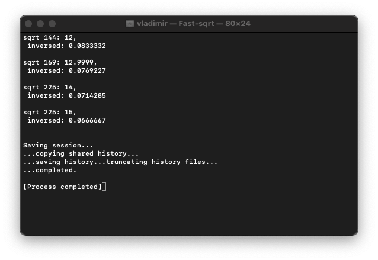

# 📝 Fast square root



## What is it?
This is a fast implementation of _inverse square root_. It is a part of [_RedLibrary_](https://github.com/Red-company/RedLibrary).

## How to use?

Function prototypes:

```C
// Fast inverse square root.
float Red::fi_sqrt(float num)
```

## Tech notes:

* Uses inside _long int_ type.

##
All material in this repository is in the public domain.
